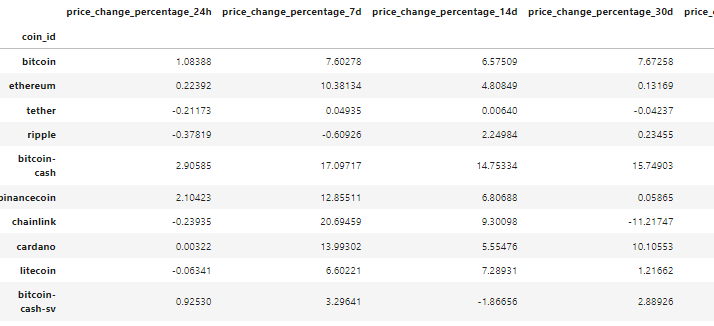
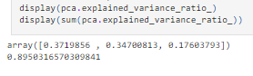
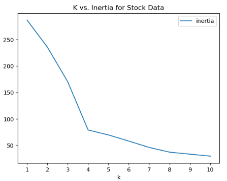
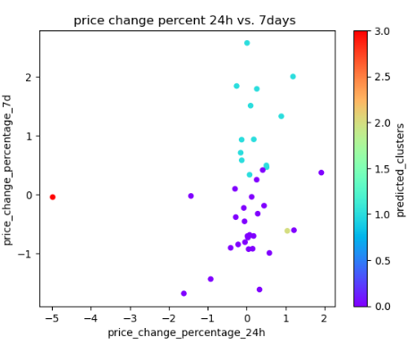
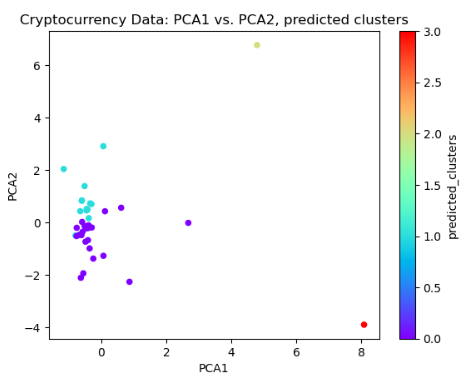
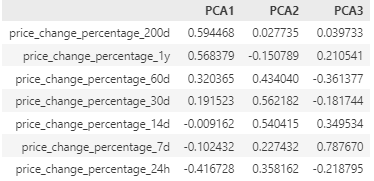

# Crypto Clustering

This project aims to apply clustering techniques to a cryptocurrency dataset to identify patterns in market data and group cryptocurrencies based on their performance. The focus is on using machine learning models to cluster cryptocurrencies by various market performance indicators.

 **[Data](#data)** : Sourcing | Pre-Processing | Feature Transformation
 **[Exploratory Data Analysis (EDA)](#exploratory-data-analysis-eda)** : Visualizations | Correlation Analysis
 **[Modeling](#modeling)** : Model Selection | Training
 **[Evaluation](#evaluation)** : Metrics | Cross-Validation
 **[Interpretation](#interpretation)**

---

## Abstract

The project clusters cryptocurrency market data using unsupervised Machine Learning algorithm **k-means clustering**. The goal is to identify and group cryptocurrencies based on their price change percentages over different timeframes. The analysis involves cleaning and transforming the data, performing exploratory data analysis (EDA), applying feature transformations, and evaluating clustering models using the elbow method.

---

## Data

### Sourcing

Data is for cryptocurrency market performance metrics, including percentage changes in price over different time intervals (24 hours, 7 days, 14 days, etc.).

<figure>
    <figcaption><em></em></figcaption>
    
</figure>

### Pre-Processing

* Missing data was handled by dropping rows with insufficient data.
* `StandardScaler()` module from `scikit-learn` used to to normalize the market performance indicators (price changes) to ensure uniformity before clustering.

---

## Exploratory Data Analysis (EDA)

* **Visualizations: matplotlib** and **seaborn** to create histograms and scatter plots to visualize distributions and relationships between price change percentages.
* Correlation Analysis used to assess feature correlations.

### Correlation Analysis

* Analyzed the relationships between price change percentages over different time intervals to

### Descriptive Statistics

* Generated statistics like mean, median, and standard deviation to understand the distribution of market performance indicators.

---

## Modeling

#### Optimize Clusters with Principal Component Analysis (PCA)

Performed PCA to reduce the features to three principal components. Determined the total explained variance of the components to be ~89%

<figure>
    <figcaption><em></em></figcaption>
    
</figure>

#### Hyperparameter Tuning

* **Elbow method** used to determine optimal number of clusters by analyzing the inertia values across different k values.  k=4 shows the largest change in slope

<figure>
    <figcaption><em></em></figcaption>
    
</figure>

#### Cluster Cryptocurrencies (Original Data and PCA Data)

**k-Means clustering** used k-means to group cryptocurrencies based on market performance.  Used optimal n_clusters = 4, determined in previous step and applied it to the **original data**, as well as the reduced **PCA data**:

* **Fig 1:** Scatter plot for **price_change_percentage_24h vs. price_change_percentage_7d**, displaying predicted clusters in different colors.
* **Fig 2**: Scatter plot for **PCA1 vs. PCA2**, displaying predicted clusters, color-coded.

<figure>
    <figcaption><em>Fig 1: K-Means on the original data:</em></figcaption>
    
</figure>

<figure>
    <figcaption><em>Fig 2: K-Means on PCA data:</em></figcaption>
    
</figure>

#### Determine the Weights of Each Feature on Each Principal Component

Original data features vs. the PCA values, showing weights (significance) of each feature for each principal component (PCA1, PCA2, PCA3).  Presented below, sorted by PCA 1, PCA 2, and PCA 3 columns):

<figure>
    <figcaption><em>Top Feature Weights for PCA 1 (sorted by PCA 1 column):</em></figcaption>
    
</figure>

<figure>
    <figcaption><em>Top Feature Weights for PCA 2 (sorted by PCA 2 column):</em></figcaption>
    
</figure>

<figure>
    <figcaption><em>Top Feature Weights for PCA 3 (sorted by PCA 3 column):</em></figcaption>
    
</figure>

## Results of PCA Feature Analysis

The clustering analysis grouped cryptocurrencies based on their price performance over various time intervals. The optimal number of clusters was determined using the elbow method, and cryptocurrencies with similar market behaviors were successfully grouped.  Features with the strongest positive or negative influence on each PCA component:

**PCA1:**   Features with the largest impact on **PCA1** are price_change_percentage_200d (~59%), _1y (~57%), _60d (~32%), _30d (~19%).  These are the features that have the **longest** time periods, with the two longest periods  **(200 day, 1 year) ** having the most significant impacts.

**PCA2:**   Features that have the largest impact on **PCA2** are price_change_percentage_30d (~56%), _14d (~54%), _60d (~43%), _24h (~35%), _7d (~22%).  These features representing the **shorter** of the time periods.  In fact, the longest two periods (1 year, 200 days) have little impact on  **PCA2**.

**PCA3:** Features that have the largest impact on **PCA3** are price_change_percentage_7d (~78%), _14d (~35%), _1y (~21%).  These features skew towards 1-2 week periods  **(7d, 14d)**, but also include the 1 year.  The **7 day** is the single feature with the largest positive influence on the PCA values at **78%**.

---
