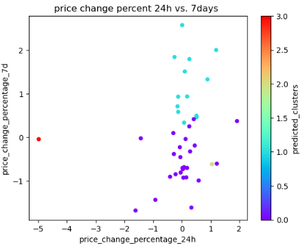
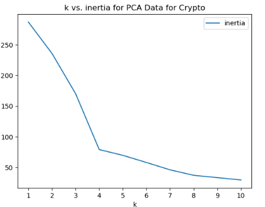
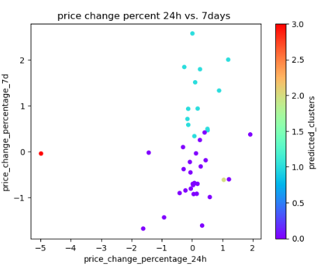
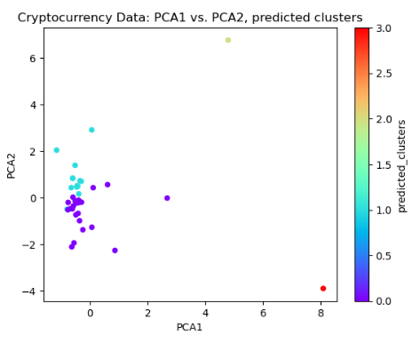

# Module 11 Challenge: Crypto Clustering

Utilitzing K-means algorithm and principal component analysis (PCA), classify cryptocurrencies according to their price fluctuations across various timeframes.

### Starting out

file `Crypto_Clustering.ipynb`. draws data from `crypto_market_data.csv`

    

#### Prepare the Data

Scale data with `StandardScaler()` module from `scikit-learn` to normalize the data from the CSV file.

    

Identify best value for k Using scaled DataFrame, by using elbow method to calculate and graph interia of values for k from 1-10.

Visually determined the optimal value for `k` to be **4 clusters.**

    

#### Cluster Cryptocurrencies with K-Means Using the Original Scaled Data

Using calculated k from previous steps, cluster the cryptocurrencies and run a scatter plot of "price_change_percentage_24h" v "price_change_percentage_7d", displaying the predicted clusters color-coded.

    

#### Optimize Clusters with Principal Component Analysis

Perform PCA to reduce the features to three principal components.

Deterined the total explained variance of the components to be ~89%

#### Find the Best Value for k Using the PCA Data

Again, used elbow method on PCA data to identify best value for `k`.

**Optimal K value determined to be 4**, identical to that calculated on the original data.

    

#### Cluster Cryptocurrencies with K-Means Using the PCA Data

Using calculated k from previous steps, cluster the cryptocurrencies and run a scatter plot of "PCA1" vs. "PCA2", displaying the predicted clusters, color-coded.

Determined there is little difference between using fewer features to using KMeans to **cluster the PCA data (Image 2)** as compared to running KMeans on the **full, original scaled data (Image 1)**

**Image 1**: KMeans clusters using **Full Original (Scaled) Data.	**

 **Image 2**: KMeans predicted clusters using **PCA data (3 components).**

#### Determine the Weights of Each Feature on Each Principal Component

Created a DataFrame the original data features vs. the PCA values that shows the weights of each feature for each principal component (PCA1, PCA2, PCA3)

The following DataFrames are sorted by values PCA1, PCA2, PCA3 (respectively):

Features with the strongest positive or negative influence on each PCA component:

**PCA1:**

* Features that have the largest impact on  **PCA1** are "price_change_percentage:

 **_200d (~59%), _1y (~57%), _60d (~32%), _30d (~19%)**

* These are the features that have the longest time peridos, with the two longest periods  **(200 day, 1 year) ** having the most significant impacts.

**PCA2:**

* Features that have the largest impact on  **PCA2** are "price_change_percentage:

 **_30d (~56%), _14d (~54%), _60d (~43%), _24h (~35%), _7d (~22%)**.

* These features representing the shorter of the time periods and have a larger number of features that appear to impact  **PCA2 **.
* The longest two periods **(1 year, 200 days) ** have little impact on  **PCA2**.

**PCA3:**

* Features that have the largest impact on  **PCA3** are "price_change_percentage:

 **_7d (~78%), _14d (~35%), _1y (~21%)**.

* These features skew towards 1-2 week periods  **(7d, 14d)**, but also include the 1 year.
* The  **7 day** is the single feature with the largest positive influence on the PCA values at  **78%**.
