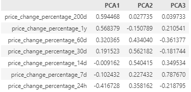
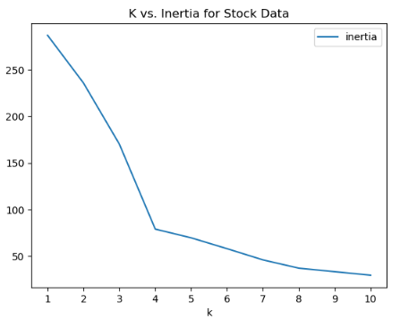

# Clustering Cryptocurrencies with K-Means

This project applies clustering techniques to a cryptocurrency dataset to identify patterns in market data and group cryptocurrencies by their performance. The focus is on using machine learning models to cluster cryptocurrencies by various market performance indicators.

**[Data](#data)** : [Sourcing](#sourcing) | [Pre-Processing
](#pre-processing)**[Exploratory Data Analysis (EDA)](#exploratory-data-analysis-eda)** : [Optimize with Principal Component Analysis (PCA)](#optimize-clusters-with-principal-component-analysis-pca) | [Feature Weights for each Principal Component](#feature-weights-for-each-principal-component) | [Hyperparameter Tuning](#hyperparameter-tuning)
**[Modeling](#modeling)** : [K-Means Clustering](#k-means-clustering) | [Original Data vs PCA Data](#original-data-vs-pca-data)
**[Technologies and Tools](#technologies-and-tools)**

---

## Abstract

The project clusters cryptocurrency market data using the unsupervised Machine Learning algorithm  **k-means clustering** . The goal is to identify and group cryptocurrencies based on their price change percentages over different timeframes. The analysis involves cleaning and transforming the data, performing exploratory data analysis (EDA), and applying clustering to find patterns.

---

## Data

### Sourcing

Data is for cryptocurrency market performance metrics, including percentage changes in price over different time intervals (24 hours, 7 days, 14 days, etc.).

<figure>
    <figcaption><em></em></figcaption>
    
</figure>

### Pre-Processing

* Missing data was handled by dropping rows with insufficient data.
* `StandardScaler()` module from `scikit-learn` used to to normalize the market performance indicators (price changes) to ensure uniformity before clustering.

---

## Exploratory Data Analysis (EDA),

#### Optimize with Principal Component Analysis (PCA)

Performed PCA to reduce the features to three principal components. Determined the total explained variance of the components to be ~89%

<figure>
    <figcaption><em></em></figcaption>
    
</figure>

#### Feature Weights for each Principal Component

Features with the strongest positive or negative weights (influence) on each PCA component.

* **PCA1:**   Features with the largest impact on **PCA1** are price_change_percentage_200d (~59%), _1y (~57%), _60d (~32%), _30d (~19%).  These are the features that have the **longest** time periods, with the two longest periods  **(200 day, 1 year) ** having the most significant impacts.
* **PCA2:**   Features that have the largest impact on **PCA2** are price_change_percentage_30d (~56%), _14d (~54%), _60d (~43%), _24h (~35%), _7d (~22%).  These features representing the **shorter** of the time periods.  In fact, the longest two periods (1 year, 200 days) have little impact on  **PCA2**.

* **PCA3:** Features that have the largest impact on **PCA3** are price_change_percentage_7d (~78%), _14d (~35%), _1y (~21%).  These features skew towards 1-2 week periods  **(7d, 14d)**, but also include the 1 year.  The **7 day** is the single feature with the largest positive influence on the PCA values at **78%**.

Tables for each principal component (sorted by PCA1, PCA2, PCA3):

<figure>
    <figcaption><em>Top Feature Weights for PCA 1 (sorted by PCA 1 column):</em></figcaption>
    
</figure>

<figure>
    <figcaption><em>Top Feature Weights for PCA 2 (sorted by PCA 2 column):</em></figcaption>
    
</figure>

<figure>
    <figcaption><em>Top Feature Weights for PCA 3 (sorted by PCA 3 column):</em></figcaption>
    
</figure>

#### Hyperparameter Tuning

* **Elbow method** used to determine optimal number of clusters by analyzing the inertia values across different k values.  k=4 shows the largest change in slope

<figure>
    <em></em></figcaption>
</figure>

## Modeling

Modeling was performed with the **k-Means clustering** algorithm to group cryptocurrencies based on their price performance over various time intervals.

Optimal n_clusters = 4 was determined in a previous step and applied it to the **original data** and the reduced **PCA data** (to see if any significant differences existed).

**Fig 1:** Scatter plot for the Original Data, **price_change_percentage_24h vs. price_change_percentage_7d**, displaying predicted clusters in different colors:

<figure>
    
    <figcaption><em>Fig 1: K-Means on the original data:</em></figcaption>
</figure>

**Fig 2**: Scatter plot for **PCA1 vs. PCA2**, displaying predicted clusters, color-coded:

<figure>
    
<figcaption><em>`Fig 2: K-Means on PCA data:</em></figcaption>
</figure>

---

## Technologies and Tools

* **Tools and Libraries** : Python, Pandas, and Jupyter Notebook for data analysis and reporting.
* **Data Cleaning and Preparation** : Cleaned the dataset, handled missing data, and ensured consistent formatting across the dataset.
* **Data Scaling** : Used **StandardScaler** from **scikit-learn** to normalize features for clustering.
* **Visualizations** : Created histograms, scatter plots, and correlation heatmaps using **matplotlib** and  **seaborn** .
* **Clustering Algorithm** : Applied **k-means** from **scikit-learn** to perform clustering analysis.
* **Elbow Plot** : Used to determine the optimal number of clusters for k-means by plotting inertia values.
